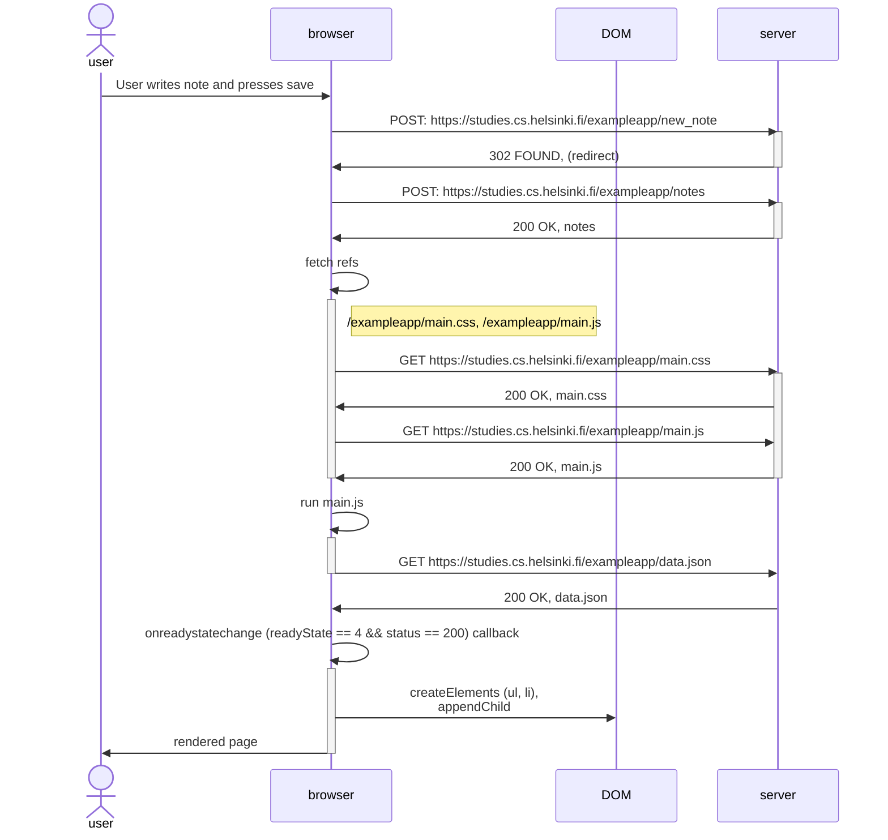
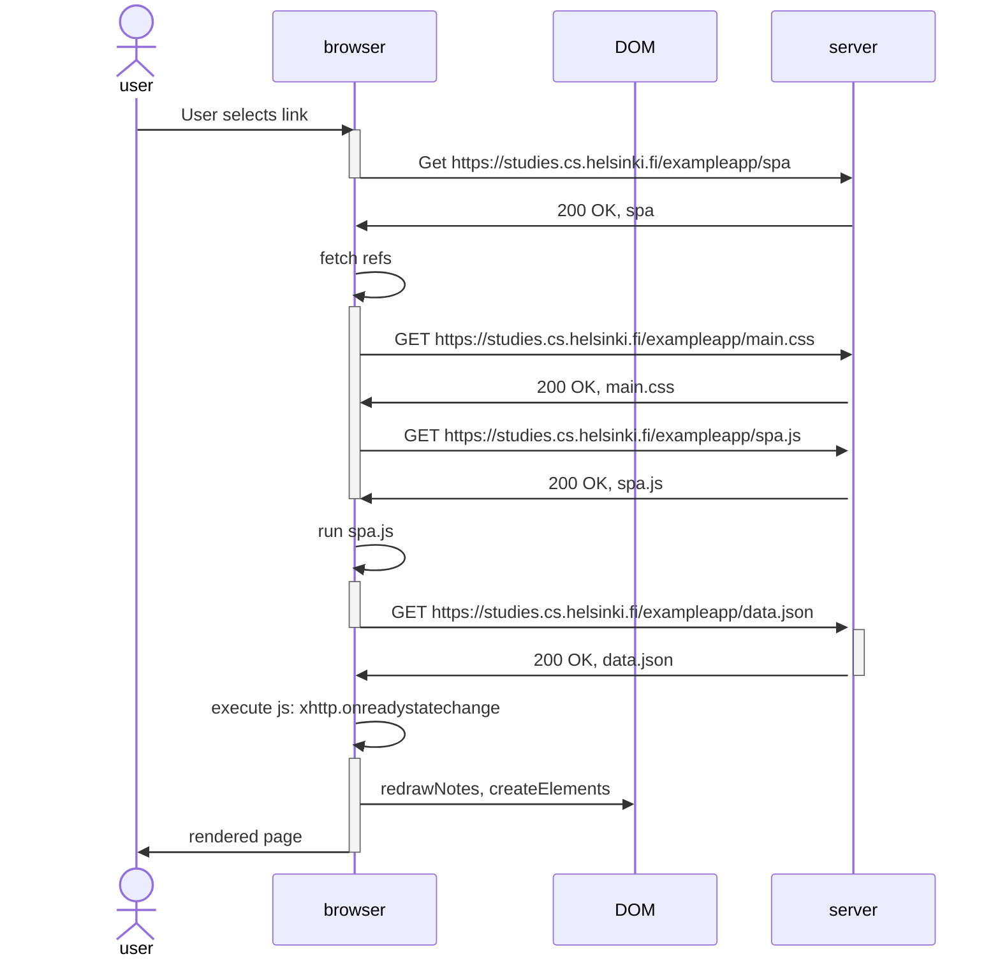
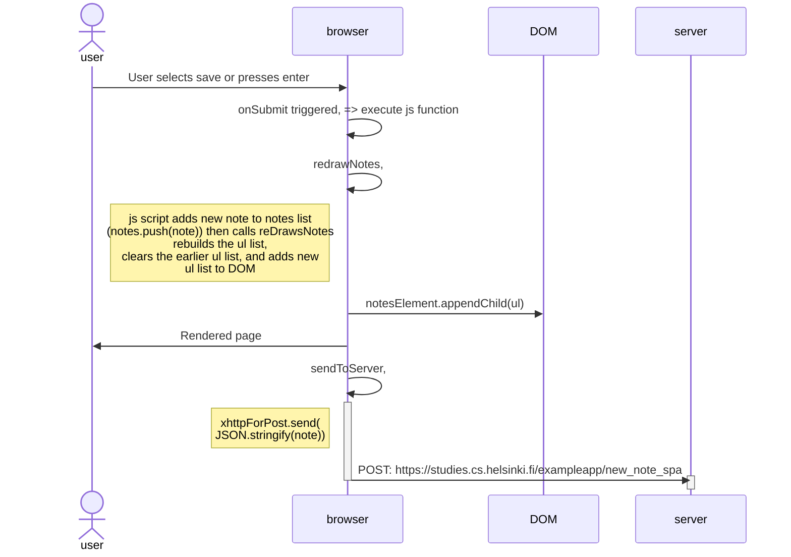

osan 0 tehtävien vastaukset

# 0.4: Uusi muistiinpano

(DOM = document object model)

```mermaid
sequenceDiagram
    actor user
    participant browser
    participant DOM
    participant server

    user->>browser: User writes note and presses save
    browser->>server: POST: https://studies.cs.helsinki.fi/exampleapp/new_note
    activate server
    server->>browser: 302 FOUND, (redirect)
    deactivate server
    browser->>server: POST: https://studies.cs.helsinki.fi/exampleapp/notes
    activate server
    server->>browser: 200 OK, notes
    deactivate server

    browser->>browser: fetch refs
    activate browser
    Note right of browser:/exampleapp/main.css, /exampleapp/main.js
    browser->>server: GET https://studies.cs.helsinki.fi/exampleapp/main.css
    activate server
    server->>browser: 200 OK, main.css
    browser->>server: GET https://studies.cs.helsinki.fi/exampleapp/main.js
    server->>browser: 200 OK, main.js
    deactivate browser
    deactivate server
    browser->>browser: run main.js
    activate browser
    browser->>server: GET https://studies.cs.helsinki.fi/exampleapp/data.json
    deactivate browser
    server->>browser: 200 OK, data.json
    browser->>browser: onreadystatechange (readyState == 4 && status == 200) callback
    activate browser
    browser->>DOM: createElements (ul, li),<br>appendChild
    browser->>user: rendered page
    deactivate browser
```

# 0.5: Single Page App

```mermaid
sequenceDiagram
    actor user
    participant browser
    participant DOM
    participant server

    user->>browser: User selects link
    activate browser
    browser->>server: Get https://studies.cs.helsinki.fi/exampleapp/spa
    deactivate browser
    server->>browser: 200 OK, spa
    browser->>browser: fetch refs
    activate browser
    browser->>server: GET https://studies.cs.helsinki.fi/exampleapp/main.css
    activate server
    server->>browser: 200 OK, main.css
    browser->>server: GET https://studies.cs.helsinki.fi/exampleapp/spa.js
    server->>browser: 200 OK, spa.js
    deactivate browser
    browser->>browser: run spa.js
    activate browser
    browser->>server: GET https://studies.cs.helsinki.fi/exampleapp/data.json
    deactivate browser
    activate server
    server->>browser: 200 OK, data.json
    deactivate server
    browser->>browser: execute js: xhttp.onreadystatechange
    activate browser
    browser->>DOM: redrawNotes, createElements
    browser->>user: rendered page
    deactivate browser
```

# 0.6: Uusi muistiinpano

```mermaid
sequenceDiagram
    actor user
    participant browser
    participant DOM
    participant server

    user->>browser: User selects save or presses enter
    browser->>browser: onSubmit triggered, => execute js function
    browser->>browser: redrawNotes,
    Note left of browser: js script adds new note to notes list<br>(notes.push(note)) then calls reDrawsNotes <br> rebuilds the ul list, <br> clears the earlier ul list, and adds new <br> ul list to DOM
    browser->>DOM: notesElement.appendChild(ul)
    browser->>user: Rendered page
    browser->>browser: sendToServer,
    activate browser
    Note left of browser: xhttpForPost.send(<br>JSON.stringify(note))
    browser->>server: POST: https://studies.cs.helsinki.fi/exampleapp/new_note_spa
    deactivate browser
    activate server

    deactivate server

```
